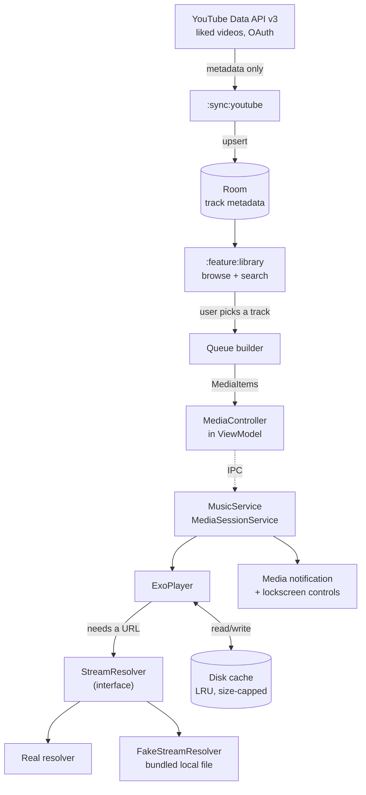

# Architecture

How the whole system fits together, and **why** — the reasoning matters more than the
decision, because a decision without its reasoning gets reversed by accident six months
later.

Requirements this serves: [`REQUIREMENTS.md`](REQUIREMENTS.md).

---

## The three constraints that don't bend

Everything else is negotiable. These are not.

### 1. Stream resolution sits behind a single interface, with a fake for tests

Turning a track identifier into a playable audio URL is **the only genuinely volatile part
of this codebase**. Volatile in two distinct senses:

- **Technically** — it depends on undocumented, unversioned behaviour that can change
  without notice. Everything else here sits on documented, versioned APIs. When this
  breaks, it breaks suddenly and completely.
- **In terms of standing** — this is the one layer whose acceptability under YouTube's
  terms of service is genuinely unsettled, unlike the Data API usage in constraint 3,
  which is straightforwardly sanctioned.

Both point the same way: **isolate it so it can be replaced, or removed entirely, without
touching anything else.** The interface is the firewall.

```kotlin
interface StreamResolver {
    suspend fun resolve(trackId: TrackId): Result<ResolvedStream>
}

data class ResolvedStream(
    val uri: Uri,
    val expiresAt: Instant?,
    val mimeType: String?,
)
```

That's the entire contract. Nothing above it knows how a URI was obtained. Consequences
that make this worth the discipline:

- **`FakeStreamResolver` returns a bundled local audio file.** Everything upstream — queue,
  player, session, cache, UI — becomes testable and buildable with no network at all. This
  is what lets Stages 2 and 3 be built and verified on a phone before Stage 5 exists.
- Swapping the real implementation is a **one-line change in a Hilt module**. No call site
  changes.
- If the layer has to be removed, the app degrades to a local-file player rather than
  collapsing.
- The `Result` return type is deliberate: resolution failure is an **expected outcome**,
  not an exception. Callers are forced to handle it, which is what keeps a failure here
  from becoming a crash.

`expiresAt` exists because resolved URLs are typically short-lived. The player layer
re-resolves rather than caching a URI indefinitely — a subtle failure mode that's much
cheaper to design for now than to debug later from a logcat dump.

### 2. Playback lives in a `MediaSessionService` — never a ViewModel or Activity

Requirement M1 is that audio survives screen-off, app-switch, and doze. **Anything owned by
a UI component dies with that component.** A ViewModel outlives configuration changes but
not process death or Activity destruction; an Activity doesn't even survive rotation
without help. Neither is a valid home for a player that must outlive the UI entirely.

So:

- `MusicService : MediaSessionService` owns the one and only `ExoPlayer` instance.
- The service runs in the foreground with a media notification — which is also exactly
  what satisfies M2, since Media3 derives lockscreen and notification controls from the
  `MediaSession` automatically. One mechanism, both requirements.
- **ViewModels hold a `MediaController`, never a player.** The controller is a thin remote
  handle to the session. UI observes state through it and sends commands to it.
- The UI can be destroyed and recreated freely. It reconnects to the running session and
  picks up current state. Playback never notices.

The inversion is the point: **the UI is a client of playback, not its owner.** Get this
backwards and M1 is unfixable without a rewrite.

### 3. Library metadata comes from the official YouTube Data API v3, kept fully separate from stream resolution

Metadata sync uses the **official, documented, versioned** YouTube Data API v3 with OAuth
against my own account. Liked videos are reached by a documented path:

```
channels.list(part=contentDetails, mine=true)
  -> contentDetails.relatedPlaylists.likes   # a playlist ID
playlistItems.list(playlistId=<that>, part=snippet,contentDetails)
  -> paginate via nextPageToken
```

**The Data API returns metadata only. It never returns audio streams.** That is not a
limitation to work around — it's the reason the two concerns are separate systems in the
first place.

Keeping them apart means:

- **Different reliability profiles stay isolated.** The Data API is stable and versioned;
  stream resolution is not. Coupling them would drag the stable half down to the
  reliability of the unstable half.
- **Different auth.** OAuth tokens for the Data API have nothing to do with stream
  resolution and must not leak into it.
- **Different standing.** The metadata half is unambiguously sanctioned use of a public
  API on my own account. That stays true regardless of what happens to the other half.
- **The library survives independently.** If stream resolution stops working entirely, the
  library still syncs, still browses, still searches. The app is degraded, not dead.

Concretely: `:sync:youtube` and `:stream` **must not depend on each other**, and neither
may import the other's types. The only thing they share is a `TrackId`, defined in
`:core:model` and owned by neither.

---

## Modules

```
:app                  Application class, MainActivity, Hilt setup, navigation host
:core:model           Pure Kotlin domain types (Track, TrackId, Queue…). No Android deps.
:core:data            Room database, DataStore, repositories
:core:media           MusicService, player, queue management, cache
:feature:library      Library browse + search UI
:feature:player       Now-playing + queue UI
:sync:youtube         YouTube Data API v3 client, OAuth, sync into Room
:stream               StreamResolver interface, FakeStreamResolver, real implementation
```

**Why modules at all, on a solo project?** Two reasons that pay off immediately rather
than theoretically. First, **module boundaries enforce constraints 1 and 3 mechanically** —
if `:sync:youtube` can't see `:stream` in its Gradle dependencies, the separation can't be
violated by an absent-minded import. A comment saying "don't couple these" is not
enforcement; a build failure is. Second, **`:core:model` having no Android dependencies
means its tests are plain JVM tests** that run fast in CI, which matters when CI is the
only automated verification available.

Dependency direction, strictly one-way:

```
:app ──> :feature:* ──> :core:data ──> :core:model
  │           │              │
  │           └──> :core:media ──> :stream ──> :core:model
  │                    │
  └──> :sync:youtube ──┘ (both -> :core:data, never to each other)
```

`:core:model` depends on nothing. Nothing depends on `:app`. `:sync:youtube` and `:stream`
never touch.

---

## Data flow



Walking it end to end:

1. **Sync.** `:sync:youtube` authenticates via OAuth, walks the liked-videos playlist, and
   upserts metadata into Room. It writes metadata and nothing else — it never resolves a
   stream and never touches the player.
2. **Room is the single source of truth for the library.** The UI reads from Room, never
   from the network. This is what makes M6's cold-start requirement achievable: the
   library is on disk, so it renders immediately, and sync is a background refresh rather
   than a load-bearing step.
3. **Browse.** `:feature:library` observes Room through a repository as a `Flow`. Changes
   from a sync propagate to the UI automatically.
4. **Queue construction.** Picking a track builds a queue of `MediaItem`s carrying
   `TrackId` and display metadata — **not** a resolved URL. Resolution is deferred to
   playback time, because URLs expire (see `expiresAt`) and pre-resolving an entire queue
   would waste work and produce stale URIs.
5. **Command.** The ViewModel's `MediaController` sends the queue to the session across
   process boundaries. The UI's involvement ends here.
6. **Playback.** `MusicService` hands items to `ExoPlayer`. When audio is actually needed,
   a custom data source calls `StreamResolver.resolve()` — the **only** point in the
   system where that interface is invoked.
7. **Cache.** Media3's `CacheDataSource` sits in front of the network with an LRU evictor
   bounded by the user's configured cap (M4). Cache keys are `TrackId`, **not** the
   resolved URL — critical, because URLs change between resolutions while the track does
   not. Keying on the URL would silently defeat caching entirely.
8. **Notification.** Media3 renders the notification and lockscreen controls from the
   session's state. We supply metadata and let the framework do it, rather than managing a
   notification by hand and keeping it in sync ourselves.

---

## Other decisions worth recording

**Single-activity with Compose navigation.** One `MainActivity` hosting composable
destinations. Avoids multi-Activity lifecycle and back-stack complexity, and gives exactly
one place where the `MediaController` connection is established and torn down.

**Room for library, DataStore for preferences.** Different shapes, different tools. Room
handles thousands of queryable, relational track rows; DataStore handles a handful of
scalar settings (cache cap, shuffle mode, repeat mode, sleep timer) with no schema or
migration overhead. Using Room for preferences would be ceremony for no gain; using
DataStore for the library would mean loading everything into memory to search it.

**Hilt for dependency injection.** The payoff is concentrated at the `StreamResolver`
swap in constraint 1 — fake and real implementations differ by one binding, and tests
substitute a fake without touching production code. It also solves injecting into a
Service cleanly, which is otherwise awkward on Android.

**Coil for images.** Compose-native, handles caching and lifecycle-aware cancellation,
which is what keeps artwork scrolling smooth for M6.

**Min SDK 26.** Foreground service and notification-channel behaviour is consistent from
26 onward, removing a class of compatibility branching in exactly the area that carries
the hardest requirement. Since this ships to one known device, there is no reach argument
for going lower.

**Errors surface, they don't hide.** Sync failures, resolution failures, and cache errors
all become visible state the UI can show — never a silent no-op. With no automated
runtime testing and a single human reporting behaviour, a swallowed error is
indistinguishable from a feature that was never built. See [`CLAUDE.md`](CLAUDE.md).

---

## Testing boundaries

Added when `:core:media`'s Robolectric tests were written (Phase B of the overnight
A–D build), because it's easy to look at a green `PlaybackServiceControllerTest` run and
conclude more than it actually proves. Stated plainly, in both directions:

### What Robolectric proves

- **Manifest correctness.** `PlaybackServiceManifestTest` asks the real, merged
  `PackageManager` whether the service is declared with `foregroundServiceType`,
  the `MediaSessionService` intent-filter, and the right permissions requested — not a
  hand-read of the XML. If the manifest is wrong, this fails.
- **Service lifecycle.** `onCreate` builds a session, `onDestroy` releases it, and a
  start command (Android re-invoking the service while it's already running — the
  "backgrounded" case) doesn't tear it down. This is real code executing, not a mock.
- **Session ↔ controller wiring.** A real `MediaController` really connects to a real
  `MediaSessionService` — Robolectric shadows the framework classes involved
  (`Context.bindService`, `Looper`, etc.) well enough that this is a genuine integration
  test of the connection handshake, not a stub standing in for it.
- **Compile-time and structural correctness generally.** If `:core:media` didn't compile
  against the real Media3/AndroidX APIs, none of these tests would run at all.

### What Robolectric cannot prove — and nothing in this repo's CI can

- **Doze and extended background survival.** Robolectric's `Looper` and service shadows
  don't model Android's real power management. Whether playback survives 40+ minutes of
  actual doze, an actual screen-off period, an actual app-switch on a real device — none
  of that is exercised here at all. That's exactly why `PLAN.md` Stage 2's verification
  step is a manual, timed, on-device check, not "CI is green."
- **OEM battery/task killers.** Many Android phone vendors ship their own, non-standard
  background-process killing behavior on top of stock Android. No JVM-based test can
  simulate a specific manufacturer's battery optimizer deciding to kill this process.
  This can only be found by running the app on the actual device it needs to work on.
- **Audio focus contention.** Nothing here tests what happens when another app (a call,
  another player, a notification chime) requests audio focus while this app is playing.
  That interaction is real Android audio-system behavior with no meaningful JVM shadow.
- **Whether sound actually comes out.** This is the one worth saying without hedging:
  **Robolectric does not decode or play audio.** `controller.prepare()` and
  `mediaItemCount` succeeding in a test says the *wiring* accepted a media item — it says
  nothing about whether a speaker or headphones would ever produce sound from it. The
  first time this can be verified at all is a human pressing play on a phone.

The dividing line, in one sentence: **Robolectric verifies the plumbing; it cannot verify
the water actually runs.** Every item in the second list stays a "please check this on
your phone" item in the stage's device-verification notes, not something a green CI run
gets to claim credit for.
